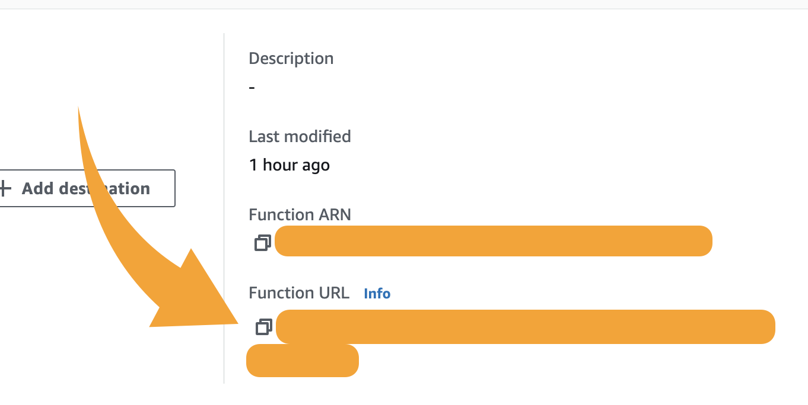

<p align="center">
  
</p>

# Site Summarizer Chrome Extension

This chrome extension creates an extractive summary of the current website. The result is passed as context to a Bedrock model for creating a more clear and concise text summary. The claude haiku 3 model is used for this project.

> **extractive summary**
> means that it tries to find the most significant sentences in the document and compose it into shortened text.

# Architecture

This solution containerizes an API. Which will handle the text summarization and bedrock communication. Lambda is used as the compute to execute the container. We leverage lambda's function url concept to be able to easily make a call to it. The chrome extension handles logic to send the current focused website to Lambda and render the returned summary.

# Deployment

### 1. add env file

```
.
├── api/
    ├── .env
    ├── app.py
    ├── deploy.sh
    ├── trust_policy.json
    └── Dockerfile
```

add the `.env` file to the `api` directory. The env file should contain the following

```
TOKEN=123456789012
ACCOUNT=123456789012
REGION=us-east-1
```

> - TOKEN - token that will be used in the authorization header when calls are made from the extension.
> - ACCOUNT - 12 digit aws account
> - REGION - operating region

### 2. deploy api

Open terminal into `api` directory
Execute `./deploy.sh`

The bash script will deploy the container to ECR, create a Lambda function for executing the container, and create the function url needed to execute it.

> Docker should be running on your machine and AWS CLI needs to be installed and configured.

### 3. get function url

<p align="center">
  
</p>

Navigate to the lambda service in the AWS console. You'll see a lambda named `sumy`. Click into it and retrieve your function url on the right panel.

### 4. update extension

In `extension/service-worker.js`

Modify line `4` with the function url recorded in step 3. Modify line `8` with the bearer token value from your api `.env` file. The syntax is `Bearer <TOKEN>`

> For a production ready application you would want to handle the token and function url differently instead of hardcoding.

### 5. load extension into chrome

Open chrome and go to `chrome://extensions/`. Make sure `Developer Mode` is enabled. Select `Load Unpacked` and select the `extension` directory in this repo.

# Shout outs

- [sumy](https://miso-belica.github.io/sumy/) - library used in this project for text summarization.
